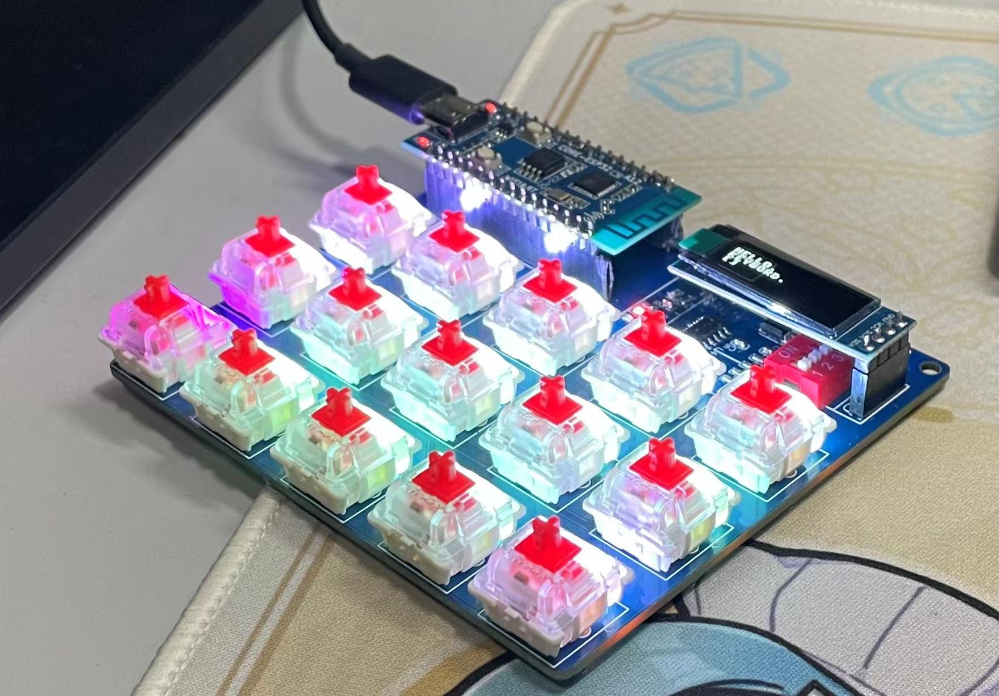
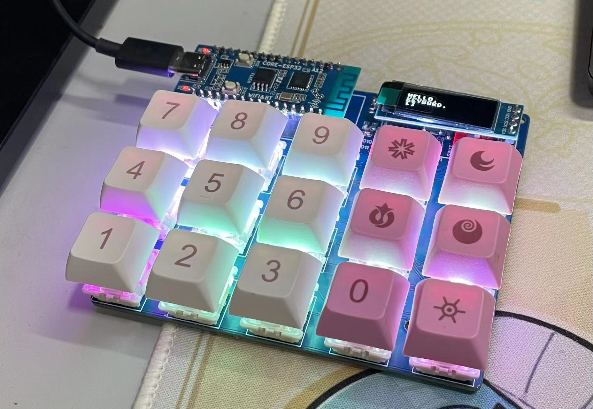

# MicroPython_keyboard
# MicroPython键盘


## 功能
+ py_keyboard.py 扫描键盘，返回键值
+ passwd_keyboard.py 实体化的密码保险箱。显示密码&用户名，自动输入密码
+ ssd1306 ssd1306的驱动来自https://github.com/micropython/micropython-lib/blob/58f8bec54d5b3b959247b73a6e8f28e8493bd30b/micropython/drivers/display/ssd1306/ssd1306.py 
+ effect.py 小屏幕用的动画，自带调试代码
+ piano.py 电子乐器，控制嗡鸣器发出不同频率的声音，对应音符共3个八度
+ autopiaon.py 自动弹一首生日快乐
+ web.py WiFi连接 管理passwd_keyboard.py可读取的密码字典 使用microdot作为webserver
##  单独使用py_keyboard.py的例子
定义一个有16个键的键盘：  
+ 需要4个GPIO作为IN0-3，另外4个GPIO作为OUT0-3。4x4=16
+ 也可以2个GPIO作为IN0-1，另外8个GPIO作为OUT0-8。2x8=16   
+ IN设置为下拉。  扫描时，1个OUT设置为高电平,3个设置为低电平。所以键盘上二极管方向应该是由OUT向IN。

```python
import py_keyboard

keyboard = py_keyboard.keyboard((0,1,6,7),(9,8,4,5))
#其中(0,1,6,7)是IN0-3的GPIO号码(9,8,4,5)是OUT0-3的GPIO号码
```
键的编号所对应连接的GPIO：
|        | IN0   |  IN1   | IN2    | IN3    |
|  ----  | ----  |  ----  | ----   | ----   |
|  OUT0  | key0 | key1  | key2 | key3 |
|  OUT1  | key4 | key5  | key6 | key7 |
|  OUT2  | key8 | key9  | key10 | key11 |
|  OUT3  | key12 | key13  | key14 | key15 |  


### 扫描并返回OUT0对应一行的值
```python
L0 = keyboard.scan_single(0)
print(L0)
#返回[0,0,0,0] 没有按键被触发
#返回[0,1,0,0] key1触发
#返回[1,1,0,0] key0、key1触发
```

### 扫描并返回所有的值
```python
all = keyboard.scan()
print(all)
#返回[[0,0,0,0],[1,0,0,0],[0,0,0,1],[0,0,1,0]] key4、key11、key14被触发
```

### 扫描并返回被触发按键的编号
```python
code = keyboard.scan_code()
print(code)
#返回[0,3,15] key0、key3、key15被触发
#由0开始
```